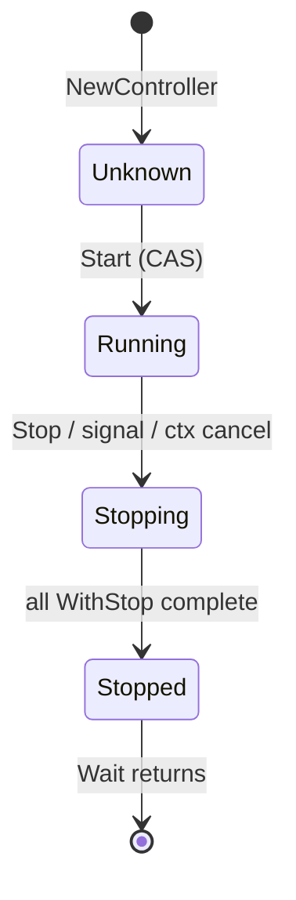

# Architecture & the lifecycle state machine

This page explains how `controls` is put together: the `Controller` at the
centre, the `Services` collection it supervises, the control goroutines that
carry messages, errors, and signals, and the four-state lifecycle that ties them
together.

## The controller and the services collection

A `Controller` owns two things worth naming:

- a **`Services` collection** — the ordered list of registered services, plus a
  `sync.Map` of per-service `ServiceInfo` (restart count, last start/stop, last
  error); and
- a set of **channels and a context** shared by the control goroutines: a
  message channel, an error channel, an OS-signal channel, a cancellable
  context, and a wait group.

`Register` appends to the services collection (defaulting a missing `Start`/`Stop`
to a no-op). `RegisterHealthCheck` adds to a separate map of standalone checks.
Both must happen before `Start`.

## The lifecycle state machine

The controller moves through four states, held under a mutex and mutated only by
guarded compare-and-set transitions:

- **`Unknown`** — constructed but not started. The only state in which
  registration is honoured.
- **`Running`** — `Start` has launched the supervisor and control goroutines.
- **`Stopping`** — a shutdown has been initiated; stop callbacks are running.
- **`Stopped`** — the shutdown sequence has completed.

The transitions are **compare-and-set** operations. `Start` only proceeds if it
can move `Unknown → Running`; a second `Start` finds the state is no longer
`Unknown` and returns. `Stop` only proceeds on `Running → Stopping`. This is what
makes `Start` and `Stop` idempotent (see
[Concurrency & shutdown correctness](concurrency.md)).

## Start, Stop, and Wait

The three lifecycle methods relate like this:

- **`Start()`** transitions to `Running`, sizes the wait group to
  *services + 1*, launches one supervisor goroutine per service, starts any async
  health checks, and launches the control goroutines — then returns immediately.
  It does **not** block.
- **`Stop()`** transitions to `Stopping` and sends a `Stop` message onto the
  message channel, where the message processor picks it up and runs the shutdown
  sequence. It too returns without waiting.
- **`Wait()`** blocks on the wait group. The group only reaches zero after the
  shutdown handler has finished the whole sequence — the "+1" lifecycle count is
  released last, so `Wait()` returning means shutdown is genuinely complete.

## The control goroutines

`Start` launches the long-lived control goroutines (via an internal `controls()`
step) alongside the per-service supervisors. There are three when signals are
enabled and two otherwise — the signal handler is only launched if `WithSignals`
supplied a channel:

| Goroutine | Watches | Job |
|---|---|---|
| **Signal handler** | the OS-signal channel | first `SIGINT`/`SIGTERM` triggers `Stop`; a second forces the handler to exit. Only launched when `WithSignals` supplied a channel |
| **Error & context handler** | the error channel and the **parent** context's `Done()` | logs forwarded service errors; triggers `Stop` when the context you passed to `NewController` is cancelled or its deadline expires |
| **Message processor** | the message channel | runs the shutdown sequence when it receives `Stop`, the only control message the package defines |

Each service runs under its own **supervisor** goroutine, which invokes
`WithStart`, classifies the outcome, applies the restart policy, and forwards
genuine errors on the error channel (see
[The restart supervisor](restart-supervisor.md)).

All of these goroutines share one exit condition: a `shutdownComplete` channel
that the shutdown handler closes once the sequence finishes. Watching it lets
each goroutine terminate cleanly rather than leak or spin — the subject of
[Concurrency & shutdown correctness](concurrency.md).

## The shutdown sequence

When the message processor receives `Stop`, the shutdown handler:

1. confirms/forces the `Stopping` state;
2. detaches OS-signal handling;
3. cancels the controller context with cause `ErrShutdown`;
4. cancels every async health check's context;
5. calls `Services.stop`, which runs each `WithStop` in reverse order under the
   shutdown-timeout context, abandoning any that overrun the deadline;
6. sets the state to `Stopped`, closes `shutdownComplete`, and releases the
   lifecycle wait-group count.

## Health reporting

`Status()`, `Liveness()`, and `Readiness()` are read-side methods, independent of
the control loop. Each walks the services collection (calling the relevant probe)
and the matching standalone checks, and returns an aggregate `HealthReport`. They
are safe to call concurrently while the controller runs. The model behind the
three is described in [Health, liveness & readiness](health-model.md).

## Related

- [Health, liveness & readiness](health-model.md)
- [The restart supervisor](restart-supervisor.md)
- [Concurrency & shutdown correctness](concurrency.md)
- [What controls does not do](limitations.md)
- [Controller reference](../reference/controller.md) — every method and its
  behaviour in each state.
